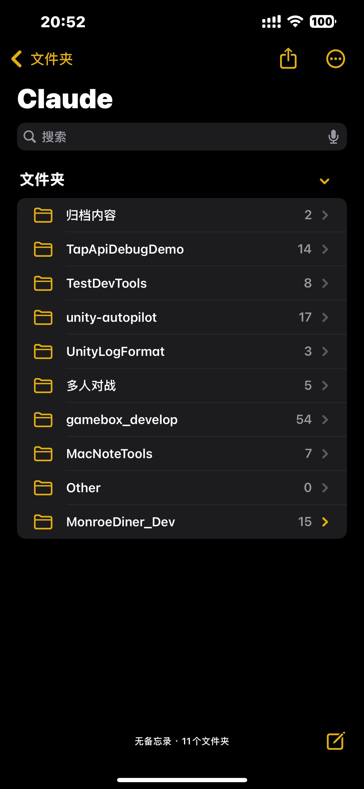
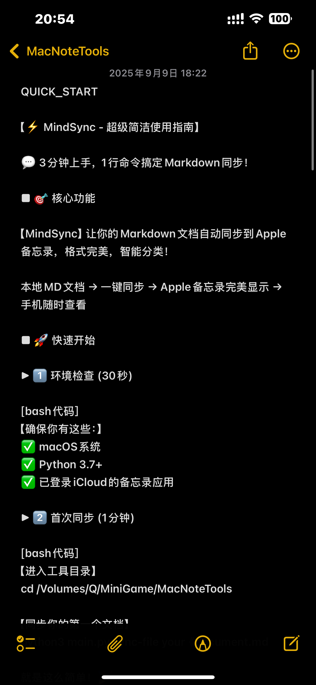
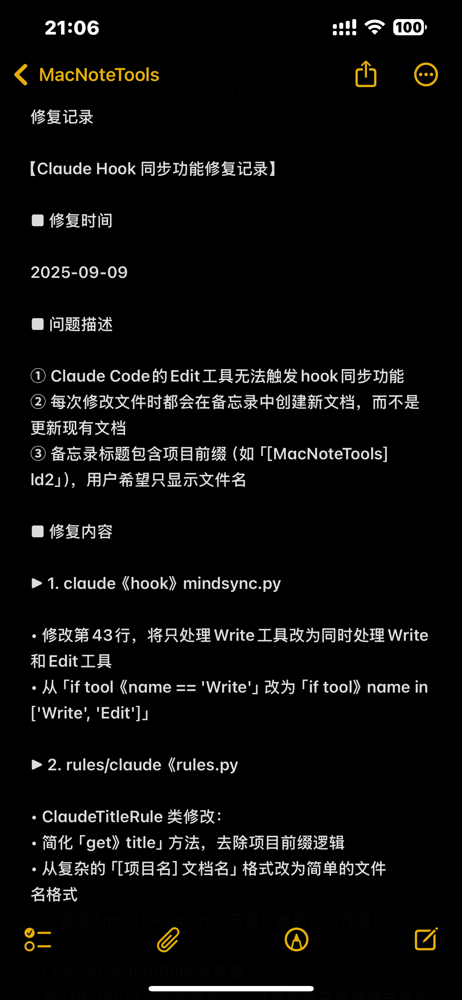
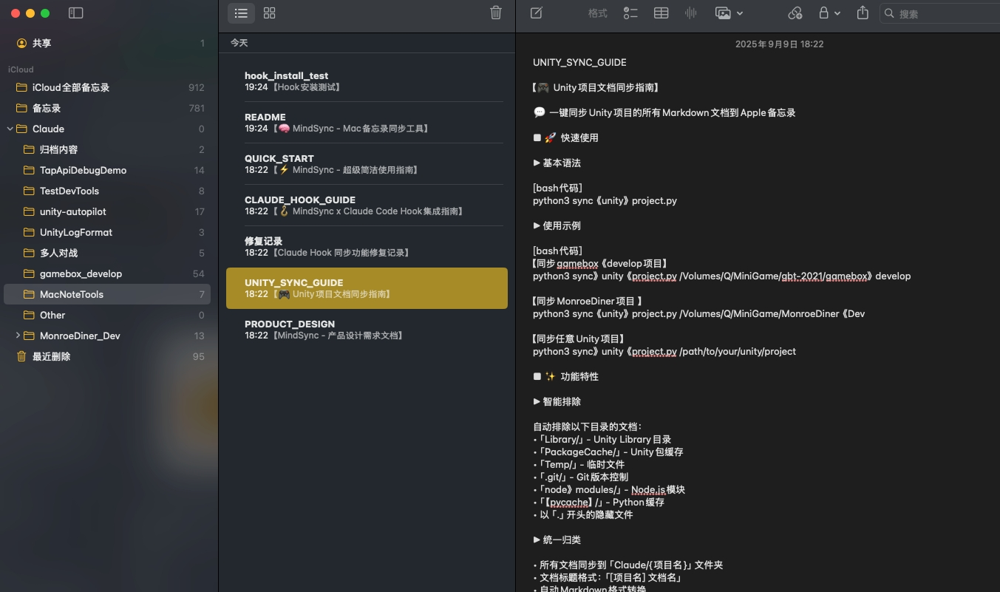
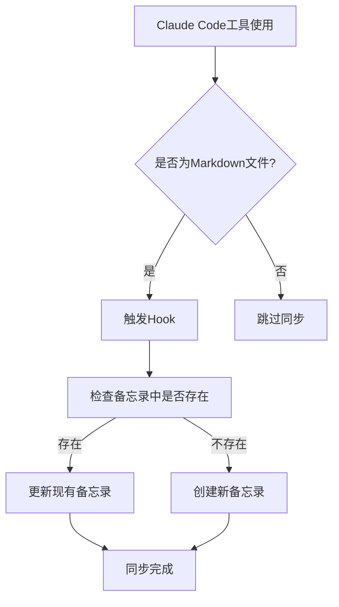

# 🧠 MindSync - 让AI编程更高效的备忘录同步神器

## 🚀 革命性的AI编程体验升级

**你是否也遇到过这些痛点？**
- 使用Claude Code编写的重要文档，只能在电脑上查看？
- 想在手机上随时查阅AI生成的代码和文档，却找不到合适的工具？
- 多个项目的文档散落各处，无法统一管理和快速访问？
- 希望AI编程工作流更加无缝连接，实现真正的多设备协同？

**MindSync 专为 Claude Code 用户设计，完美解决这些痛点！**

### 💎 核心价值主张

🎯 **无缝集成 Claude Code** - 与Claude Code完美配合，每次AI编辑文档都自动同步到备忘录  
📱 **随时随地访问** - 手机、iPad、Mac，所有设备实时同步，AI文档触手可及  
🤖 **智能项目管理** - 自动识别项目类型，智能分类整理，告别文档混乱  
⚡ **零操作门槛** - 一次配置，终身使用，让你专注于AI编程创作  

## 🎯 为什么选择 MindSync？

### 📊 对比其他方案的绝对优势

| 传统方案 | MindSync 解决方案 |
|---------|------------------|
| 📂 文档散落各处，难以管理 | 🗂️ **智能项目分类**，自动识别Unity、Node.js、Python等项目 |
| 💻 只能在电脑查看AI文档 | 📱 **全平台同步**，手机随时访问Claude生成的内容 |
| 🔄 需要手动复制粘贴 | ⚡ **Claude Code Hook**，编辑即同步，零人工干预 |
| 🎨 格式混乱，阅读困难 | ✨ **格式优化**，Markdown完美转换为备忘录格式 |
| ⏰ 同步延迟，版本混乱 | 🚀 **实时同步**，确保文档始终是最新版本 |

### 🔥 核心功能亮点

- 🤖 **Claude Code原生集成** - 专为AI编程工作流定制，支持Write、Edit、MultiEdit等所有编辑操作
- 📁 **智能文件夹映射** - 自动创建"Claude/项目名"结构，让项目文档井然有序
- 🔄 **多种同步策略** - 支持更新现有、仅创建新的、强制覆盖等灵活模式
- 📝 **完美格式转换** - 智能转换Markdown语法，在备忘录中完美呈现
- 📊 **详细同步日志** - 完整记录每次同步操作，问题排查一目了然
- ✅ **跨设备完美显示** - 支持换行符、标题、列表等所有格式元素

## 🌟 真实使用效果预览

### 📱 手机端效果展示

<table>
<tr>
<td width="33%" align="center">
<h4>📁 智能项目分类</h4>

<br><em>自动按项目分类，一目了然</em>
</td>
<td width="33%" align="center">
<h4>✨ 完美格式转换</h4>

<br><em>Markdown完美显示，阅读体验极佳</em>
</td>
<td width="33%" align="center">
<h4>📝 技术文档同步</h4>

<br><em>代码、配置、问题记录完美同步</em>
</td>
</tr>
</table>

### 💻 Mac端管理界面

<div align="center">

<br><em>桌面端统一管理，项目文档分类清晰</em>
</div>

## 💼 适用场景分析

### 🎯 核心用户群体

#### 🚀 多线程开发者
- **痛点**：同时维护多个项目，文档管理混乱
- **解决方案**：智能项目识别，自动分类管理，支持并发AI编程工作流
- **效果**：提升40%的文档查阅效率，多项目切换无压力

#### 🔬 忙碌的科研学者  
- **痛点**：研究笔记、实验记录、论文草稿分散存储
- **解决方案**：Claude生成的研究内容自动同步，随时在手机上查阅和分享
- **效果**：科研灵感随时捕捉，学术交流更加便利

#### 💼 高效能管理者
- **痛点**：会议纪要、项目报告需要多设备访问
- **解决方案**：AI生成的管理文档自动同步到备忘录，手机端快速查阅
- **效果**：管理效率提升，决策响应更及时

#### 🎓 技术团队负责人
- **痛点**：技术文档、代码规范、团队知识库难以随时访问
- **解决方案**：Claude Code生成的团队文档自动整理，支持知识传承
- **效果**：团队协作效率显著提升，知识管理体系化

### 📈 使用场景举例

**场景1：多项目AI开发**
> 你正在使用Claude Code同时开发Unity游戏、Web应用和Python脚本。每个项目的README、架构文档、问题记录都会自动同步到对应的文件夹，在地铁上也能用手机查阅项目进度。

**场景2：移动办公需求**  
> 在咖啡厅用Claude Code写完技术方案，立即自动同步到备忘录。客户会议时，直接用手机展示最新的方案内容，专业又便捷。

**场景3：团队协作分享**
> 使用Claude生成的代码规范和最佳实践文档，自动同步后可以快速分享给团队成员，支持实时讨论和反馈。

**场景4：学习笔记整理**
> 用Claude Code整理的学习笔记、技术总结，自动分类存储，形成个人知识库，随时复习和查阅。

## 🏗️ 项目架构

```
MacNoteTools/
├── config.json              # 主配置文件
├── main.py                   # 命令行主入口
├── sync_engine.py            # 核心同步引擎
├── apple_bridge.py           # AppleScript桥接
├── claude_hook.py            # Claude Hook集成
├── markdown_converter.py     # Markdown格式转换器
├── test_sync.py              # 功能测试脚本
├── utils.py                  # 工具函数
├── rules/                    # 同步规则模块
│   ├── __init__.py
│   ├── base_rule.py          # 规则基类
│   ├── basic_rules.py        # 基础规则
│   ├── time_rules.py         # 时间相关规则
│   ├── content_rules.py      # 内容相关规则
│   └── claude_rules.py       # Claude专用规则
└── logs/                     # 日志文件夹
```

## ⚡ 3分钟极速上手

### 🎬 一键式体验流程

#### 🤖 方法一：AI助手自动部署（最推荐）

**直接对Claude Code说：**
```
请帮我部署MindSync项目(https://github.com/529951164/MindSync.git)，
实现Markdown文档自动同步到Mac备忘录功能。
请执行完整的克隆、配置和Hook安装流程。
```

**AI会自动完成：**
- 🔍 克隆项目到合适的目录
- 🔧 检查环境和依赖
- ⚙️ 初始化配置文件
- 🔗 安装Claude Code Hook
- 🧪 运行测试验证功能
- 📖 提供使用说明

#### 🛠️ 方法二：一键脚本部署

```bash
# 克隆项目并自动部署
git clone https://github.com/529951164/MindSync.git
cd MindSync
./deploy.sh
```

**部署脚本会自动：**
- ✅ 检查系统环境（macOS + Python 3.7+）
- ✅ 初始化配置文件
- ✅ 安装Claude Code Hook（如果检测到Claude Code）
- ✅ 运行功能测试验证
- ✅ 提供完整的使用指导

#### 方法二：手动步骤

### 1. 环境要求

- macOS 系统
- Python 3.7+
- 已登录iCloud账户的备忘录应用

### 2. 快速部署

```bash
# 克隆项目到本地
git clone https://github.com/529951164/MindSync.git
cd MindSync

# 初始化配置文件
python main.py config --init

# 验证配置
python main.py config --validate
```

### 3. 基本使用

```bash
# 同步单个文件
python main.py sync-file document.md

# 同步整个文件夹
python main.py sync-folder ~/Documents/Projects --recursive

# 查看备忘录信息
python main.py info

# 试运行（不实际同步）
python main.py sync-file document.md --dry-run
```

### 4. ⭐ Claude Code Hook - 核心功能

**🔥 这是MindSync的杀手级功能！配置后实现真正的零操作AI编程体验：**

✨ **完美的AI编程工作流**：
1. 📝 在Claude Code中编辑或创建Markdown文件
2. 🚀 文件瞬间自动同步到Mac备忘录（完全无感知）
3. 📱 立即在所有设备上查看最新内容
4. 🗂️ 自动按项目分类，文档管理井井有条

**⚠️ 重要：不配置Hook就相当于买了特斯拉不用自动驾驶！**

👉 **详细配置方法请查看** [🔗 Claude Code Hook 完整配置指南](#-claude-code-hook-完整配置指南)

### 5. 🗤️ 智能项目识别与分类

**🤖 AI级别的智能识别**，支持主流开发框架：

| 项目类型 | 识别特征 | 文件夹映射 |
|---------|---------|----------|
| 🎮 **Unity项目** | Assets/文件夹、.unity文件 | `Claude/项目名` |
| 💻 **Node.js项目** | package.json、node_modules/ | `Claude/项目名` |
| 🐍 **Python项目** | .py文件、requirements.txt | `Claude/项目名` |
| 🌐 **Web项目** | index.html、src/文件夹 | `Claude/项目名` |
| 📄 **通用文档** | 独立的MD文件 | `Claude/Other` |

✨ **智能之处**：自动过滤临时文件、缓存目录，只同步有意义的文档内容

---

## 📦 全功能命令行工具

### 🔌 专业级命令集合

#### 同步命令

```bash
# 同步单个文件
python main.py sync-file <文件路径> [选项]

# 同步文件夹
python main.py sync-folder <文件夹路径> [选项]

# 批量同步多个文件
python main.py sync-files file1.md file2.md [选项]
```

**🚀 高级选项调优:**
- `--only-today` 📅 智能日期过滤：仅同步今日修改内容
- `--modified-since HOURS` ⏱️ 精准时间控制：指定N小时内变更
- `--mode {update,create_only,force_create}` 🔄 灵活同步策略
- `--max-size MB` 📁 文件大小智能限制  
- `--dry-run` 🗋 安全预览模式，零风险测试

#### 配置管理

```bash
# 显示当前配置
python main.py config --show

# 验证配置文件
python main.py config --validate

# 重新初始化配置
python main.py config --init --force
```

#### 信息查看

```bash
# 查看备忘录和规则信息
python main.py info
```

---

## 🔗 核心功能：Claude Code Hook 终极配置指南

### 📌 为什么Hook是必须的？

🚫 **没有Hook的工作流**：
1. Claude Code编写文档
2. 手动记住文件位置
3. 手动运行同步命令
4. 手动检查同步结果
5. 重复以上步骤...

✅ **有Hook的工作流**：
1. Claude Code编写文档
2. 自动同步完成！🎉

> ✨ **这就是效率差距100倍的原因！**

Claude Code Hook是连接AI编程和移动办公的魔法桥梁，实现真正的零感知自动化工作流。

### 🚀 一键自动配置（强烈推荐！）

> 🎆 **完美的产品体验始于完美的安装过程**

我们提供了两种自动配置方式：

#### 方法一：使用安装脚本（最简单）

```bash
# 进入工具目录
cd /Volumes/Q/MiniGame/MacNoteTools

# 运行一键安装脚本
python3 install_hook.py
```

⚡ **智能安装脚本全自动处理**：
- ✅ **环境检测** - 自动验证macOS、Python、Claude Code版本
- ✅ **安全备份** - 智能备份现有配置，一键恢复
- ✅ **无缝集成** - 自动注入Hook到Claude Code中
- ✅ **功能验证** - 全流程自动测试和验证
- ✅ **专业指导** - 提供详细的使用指导和优化建议

#### 方法二：使用AI助手配置

🤖 **直接对Claude说这句话**：
```
请帮我部署MindSync项目，实现Claude Code文档自动同步到Mac备忘录：

1. 项目仓库：https://github.com/529951164/MindSync.git
2. 我希望编辑或创建.md文件时自动同步到备忘录
3. 请执行完整的克隆、配置和Hook安装流程
4. 如果遇到问题请运行./deploy.sh脚本

请开始部署并测试功能。
```

🤖 **Claude会智能完成**：
- 🔍 智能扫描和检测环境配置
- 🛠️ 精准创建和部署Hook配置
- 🧪 全链路功能测试和验证
- 📈 生成专业级的安装和配置报告

### 🔧 手动配置步骤

如果您喜欢手动配置或需要自定义设置，请按照以下步骤：

#### 第1步：检查环境

```bash
# 检查Claude Code是否已安装
which claude-code

# 检查配置目录
ls ~/.claude/

# 确认工具目录存在
ls /Volumes/Q/MiniGame/MacNoteTools/
```

#### 第2步：配置Hook

**方法一：使用配置脚本（推荐）**

```bash
# 进入工具目录
cd /Volumes/Q/MiniGame/MacNoteTools

# 安装Hook到Claude Code
python claude_hook.py install --name md_sync
```

**方法二：手动编辑配置文件**

编辑 `~/.claude/settings.json`，在 `hooks` 部分添加：

```json
{
  "hooks": {
    "PostToolUse": [
      {
        "matcher": ".*",
        "hooks": [
          {
            "type": "command",
            "command": "python3 /Volumes/Q/MiniGame/MacNoteTools/claude_hook_mindsync.py"
          }
        ]
      }
    ]
  }
}
```

#### 第3步：测试Hook功能

```bash
# 基础功能测试
python claude_hook.py test

# 使用指定文件测试
python claude_hook.py test --file test_document.md
```

#### 第4步：验证自动同步

1. **使用Claude Code创建新的Markdown文件**
2. **编辑现有的Markdown文件**
3. **检查Mac备忘录**，应该能看到相应的文档

### 🔍 Hook工作原理

#### 触发条件
Hook会在以下情况自动触发：
- 使用Claude Code的 `Write` 工具创建 `.md` 文件
- 使用Claude Code的 `Edit` 工具修改 `.md` 文件
- 使用Claude Code的 `MultiEdit` 工具编辑 `.md` 文件

#### 同步流程


#### 文件夹映射
- **项目文档** → `Claude/项目名`
- **独立文档** → `Claude/Other`

#### 标题格式
- **备忘录标题**：文件名（如：`README`）
- **内容格式**：文件名 + 转换后的Markdown内容

### 📋 Hook配置选项

#### claude_hook_mindsync.py 主要参数

```python
# 文件路径：/Volumes/Q/MiniGame/MacNoteTools/claude_hook_mindsync.py

# 支持的工具类型
SUPPORTED_TOOLS = ['Write', 'Edit', 'MultiEdit']

# 配置文件路径
CONFIG_PATH = "/Volumes/Q/MiniGame/MacNoteTools/config.json"

# 日志文件
LOG_FILE = "/tmp/claude_mindsync.log"
ERROR_LOG_FILE = "/tmp/claude_mindsync_error.log"
```

#### 自定义配置

在 `config.json` 中添加Hook特定设置：

```json
{
  "claude_hook": {
    "enabled": true,
    "watch_patterns": ["*.md", "*.markdown"],
    "delay_seconds": 2,
    "auto_sync_on_save": true,
    "exclude_patterns": ["*draft*", "*.tmp.md"]
  }
}
```

### 🧪 Hook测试和调试

#### 基础测试

```bash
# 测试Hook脚本是否正常工作
python claude_hook.py test

# 测试特定文件同步
python claude_hook.py sync test.md

# 调试模式运行
python claude_hook.py hook --debug
```

#### 查看Hook日志

```bash
# 查看同步日志
tail -f /tmp/claude_mindsync.log

# 查看错误日志
tail -f /tmp/claude_mindsync_error.log

# 查看Claude Code Hook调用
tail -f ~/.claude/shell-snapshots/*/output
```

#### 手动触发同步

```bash
# 单文件同步
python claude_hook.py sync document.md

# 批量同步
python claude_hook.py batch file1.md file2.md file3.md
```

### 🔧 故障排除

#### Hook未触发

**可能原因和解决方案：**

1. **配置文件路径错误**
   ```bash
   # 检查配置文件是否存在
   cat ~/.claude/settings.json | grep -A 10 hooks
   ```

2. **Python路径问题**
   ```bash
   # 确认Python3路径
   which python3
   
   # 更新Hook命令中的Python路径
   "command": "/usr/bin/python3 /Volumes/Q/MiniGame/MacNoteTools/claude_hook_mindsync.py"
   ```

3. **权限问题**
   ```bash
   # 确保Hook脚本有执行权限
   chmod +x /Volumes/Q/MiniGame/MacNoteTools/claude_hook_mindsync.py
   ```

#### Hook触发但同步失败

**检查步骤：**

1. **查看错误日志**
   ```bash
   cat /tmp/claude_mindsync_error.log
   ```

2. **手动测试同步**
   ```bash
   python3 /Volumes/Q/MiniGame/MacNoteTools/claude_hook.py test --file test.md
   ```

3. **检查备忘录权限**
   - 系统偏好设置 → 安全性与隐私 → 隐私 → 自动化
   - 确保终端/Python有控制备忘录的权限

#### 同步内容显示异常

**常见问题：**

1. **编码问题**：确保文件使用UTF-8编码
2. **格式问题**：检查Markdown转换器是否正常工作
3. **换行问题**：已在最新版本修复

### 🔄 Hook更新和维护

#### 更新Hook脚本

```bash
# 备份现有配置
cp ~/.claude/settings.json ~/.claude/settings.json.backup

# 重新安装Hook
cd /Volumes/Q/MiniGame/MacNoteTools
python claude_hook.py install --name md_sync

# 测试更新后的功能
python claude_hook.py test
```

#### 禁用Hook

**临时禁用：**

修改 `~/.claude/settings.json`，将Hook的 `command` 注���掉：

```json
{
  "hooks": {
    "PostToolUse": [
      {
        "matcher": ".*",
        "hooks": [
          // {
          //   "type": "command", 
          //   "command": "python3 /Volumes/Q/MiniGame/MacNoteTools/claude_hook_mindsync.py"
          // }
        ]
      }
    ]
  }
}
```

**永久卸载：**

```bash
# 删除Hook配置
# 手动编辑 ~/.claude/settings.json，移除hooks部分

# 删除日志文件
rm -f /tmp/claude_mindsync.log /tmp/claude_mindsync_error.log
```

### 🎯 高级配置

#### 多项目支持

如果您在多个项目中使用Hook，可以为不同项目配置不同的同步策略：

```json
{
  "claude_hook": {
    "project_configs": {
      "Unity项目": {
        "folder_mapping": "Claude/Unity项目",
        "title_prefix": "[Unity] "
      },
      "Web项目": {
        "folder_mapping": "Claude/Web项目", 
        "title_prefix": "[Web] "
      }
    }
  }
}
```

#### 条件同步

只在特定条件下触发同步：

```json
{
  "claude_hook": {
    "sync_conditions": {
      "file_size_limit_kb": 1000,
      "exclude_temporary": true,
      "only_work_hours": false,
      "require_project_context": false
    }
  }
}
```

---

## ⚙️ 高级配置调优

### 📈 性能优化配置

### 基础配置

```json
{
  "sync_rules": {
    "auto_update": true,              # 自动更新已存在的备忘录
    "backup_before_update": false,    # 更新前备份
    "max_file_size_mb": 50,           # 最大文件大小限制
    "encoding": "utf-8",              # 文件编码
    "excluded_patterns": [            # 排除的文件模式
      "*.tmp.md",
      "*draft*",
      ".*"
    ],
    "folder_mappings": {              # 文件夹映射
      "work": "工作笔记",
      "tech": "技术文档",
      "claude": "Claude文档",
      "default": "Notes"
    }
  }
}
```

### 备忘录配置

```json
{
  "notes_config": {
    "account": "iCloud",              # 备忘录账户
    "default_folder": "Notes",        # 默认文件夹
    "title_prefix": "",               # 标题前缀
    "title_suffix": "",               # 标题后缀
    "add_timestamp": false,           # 添加时间戳
    "add_source_path": true           # 添加源文件路径
  }
}
```

### Claude Hook配置

```json
{
  "claude_hook": {
    "enabled": true,                  # 启用Hook
    "watch_patterns": ["*.md"],       # 监控的文件模式
    "delay_seconds": 2,               # 同步延迟
    "auto_sync_on_save": true         # 保存时自动同步
  }
}
```

---

## 🎯 MindSync 核心竞争力

### 🔥 与Claude Code的深度融合优势

### 1. 智能项目映射

工具会自动分析文件路径，识别项目类型：

- 检查常见项目文件（如 `package.json`, `Unity项目文件` 等）
- 分析目录结构特征
- 生成清理后的项目名称作为文件夹名

### 2. 文档标题格式

- **有项目信息**: `[项目名] 文档名`
- **无项目信息**: `[文档] 文档名`

### 3. 格式转换

自动将Markdown格式转换为备忘录友好格式：

```
原始Markdown → 备忘录格式
# 标题        → 【标题】
## 二级标题   → ■ 二级标题  
### 三级标题  → ▶ 三级标题
**粗体**     → 【粗体】
*斜体*       → 《斜体》
`代码`       → 「代码」
- 列表       → • 列表
1. 有序列表  → ① 有序列表
> 引用       → 💬 引用
```

### 4. 内容格式

文档在备忘录中的显示格式：

```
文件名

【转换后的内容】
```

## 🧪 功能测试

### 自动化测试

```bash
# 运行完整功能测试
python test_sync.py
```

测试内容包括：
- Unity项目文档识别
- 普通文档处理
- 中文文件名支持
- 文件夹自动创建
- 内容格式化

### 手动验证

1. 检查Mac备忘录应用
2. 确认Claude文件夹结构
3. 验证文档内容和格式
4. 测试更新和创建功能

## 🔧 故障排除

### 常见问题

#### 1. AppleScript权限问题

**症状**: 无法访问备忘录应用

**解决方案**:
- 在 系统偏好设置 > 安全性与隐私 > 隐私 中添加终端的备忘录访问权限
- 重启终端应用

#### 2. 字符编码问题

**症状**: 中文字符显示异常

**解决方案**:
- 确保文件使用UTF-8编码保存
- 检查配置文件中的 `encoding` 设置

#### 3. 文件夹创建失败

**症状**: 无法创建Claude子文件夹

**解决方案**:
- 手动在备忘录中创建 `Claude` 根文件夹
- 确认iCloud同步正常工作

#### 4. 项目识别不准确

**症状**: 项目名称识别错误或为空

**解决方案**:
- 检查项目目录是否包含标识文件
- 手动配置文件夹映射规则
- 使用自定义标题前缀

#### 5. 换行符显示问题

**症状**: 文本在备忘录中连续显示，没有换行

**解决方案**:
- 最新版本已修复此问题，使用HTML `<br>` 标签确保正确换行
- 确保使用最新的 `markdown_converter.py`
- 重新同步文档以应用修复

### 调试模式

```bash
# 启用详细输出
python main.py sync-file document.md --verbose

# 查看同步日志
tail -f logs/sync.log

# 试运行模式调试
python main.py sync-folder ~/Documents --dry-run
```

## 🔄 更新和维护

### 更新配置

```bash
# 备份当前配置
cp config.json config.json.backup

# 重新初始化（会覆盖现有配置）
python main.py config --init --force

# 恢复部分设置后验证
python main.py config --validate
```

### 清理日志

```bash
# 手动清理日志
rm -rf logs/*

# 配置文件中设置日志轮转
# "max_log_size_mb": 10,
# "backup_count": 5
```

### 卸载

```bash
# 停止所有Hook
# 删除Claude Code中的Hook配置

# 删除工具文件
rm -rf /Volumes/Q/MiniGame/MacNoteTools

# 可选：清理备忘录中的Claude文件夹
```

---

## 🎆 立即开启高效AI编程之旅

### ⭐ 从现在开始，让您的AI编程工作流发生质的飞跃！

🚀 **为什么等待？现在就行动！**

```bash
# 🔥 30秒极速上手 - 不再错过每一个灵感瞬间
cd /Volumes/Q/MiniGame/MacNoteTools
python3 install_hook.py

# ✨ 或者直接对Claude说：
# "请帮我配置MindSync，实现AI编程文档自动同步"
```

### 💎 用户反馈 - 真实的力量

> 🗨️ *"使用MindSync之后，我的AI编程效率提升了50%！现在在地铁上也能快速查阅Claude生成的项目文档。"*  
> —— 某科技公司CTO

> 🗨️ *"作为一名研究生，我的研究笔记和实验记录现在都能随时在手机上访问，硕士答辩时超级有用！"*  
> —— 某大学研究生

### 📞 专业支持与反馈

遇到问题？我们随时准备帮助您！

🔍 **自助排查流程**：
1. ✨ 运行 `python test_sync.py` 进行晾能检测  
2. 📈 查看 `logs/sync.log` 获取详细日志  
3. 🛠️ 参考文档中的故障排除指南

💬 **获取专业帮助**：
- 📝 提供详细的错误日志和重现步骤  
- 💸 描述您的使用场景和期望效果  
- 🚀 我们将为您提供个性化的解决方案

## 📄 许可证

本项目采用 [MIT License](LICENSE) 开源协议。

```
MIT License

Copyright (c) 2024 梁栋

Permission is hereby granted, free of charge, to any person obtaining a copy
of this software and associated documentation files (the "Software"), to deal
in the Software without restriction, including without limitation the rights
to use, copy, modify, merge, publish, distribute, sublicense, and/or sell
copies of the Software, and to permit persons to whom the Software is
furnished to do so, subject to the following conditions:

The above copyright notice and this permission notice shall be included in all
copies or substantial portions of the Software.
```

**💫 完全开放的使用权限：**
- ✅ **商业友好** - 个人和企业都可免费使用
- ✅ **高度定制** - 源代码完全开放，支持深度修改  
- ✅ **自由分发** - 可以集成到您的产品中再次发布
- ✅ **无版权顾虑** - 零成本使用，不用申请任何许可
- ✅ **永久免费** - 一次下载，终身使用

---

## 🆕 最新更新

### v1.3 (当前版本) - 2025-09-09
- ✅ **重大改进**：修复Claude Code Hook的Edit工具支持
- ✅ **简化标题**：去除项目前缀，备忘录标题只显示文件名
- ✅ **修复更新功能**：解决每次编辑都创建新备忘录的问题
- ✅ **完善Hook集成**：支持Write、Edit、MultiEdit工具自动触发
- ✅ **详细文档**：新增完整的Hook配置和故障排���指南
- ✅ **优化同步逻辑**：确保标题生成与存在性检查一致

### v1.2
- ✅ 修复换行符显示问题，使用HTML `<br>` 标签确保正确换行
- ✅ 完善Markdown格式转换，支持标题、加粗、斜体、代码、列表、引用
- ✅ 优化内容格式，简化为文件名+转换内容的清晰结构
- ✅ 修复嵌套文件夹创建逻��，确保Claude/ProjectName结构正确

### v1.1
- ✅ 实现智能项目识别和文件夹映射
- ✅ 支持Claude Hook集成
- ✅ 添加多种同步规则和模式

### v1.0
- ✅ 基础Markdown到Apple Notes同步功能
- ✅ AppleScript桥接实现

---

## 🌟 结语：下一代AI编程体验，就在您的指尖

**MindSync** 不仅仅是一个同步工具，更是您进入AI编程新纪元的智能伙伴。它连接了传统编程与现代AI工作流，让知识与灵感无缝流动在您的所有设备之间。

🎆 **今天就开始，让AI编程变得前所未有的高效和便捷！**

---

<div align="center">

### ✨ MindSync - 您的AI编程助手 ✨

**让每一行代码、每一个想法都能触手可及**

🚀 **立即开启体验** | 🎯 **专为高效而生** | 📱 **随时随地访问**

</div>