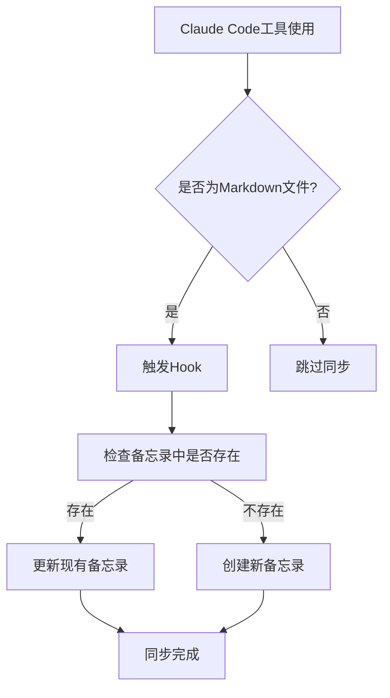

# 🧠 MindSync - Mac备忘录同步工具

一个强大的Markdown文档同步工具，可以将本地MD文档自动同步到macOS备忘录中，支持智能项目识别、文件夹映射和Claude Code集成。

## ✨ 特性

- 🤖 **智能项目识别**: 自动识别Unity、Node.js、Python等项目类型
- 📁 **智能文件夹映射**: 根据项目自动创建和映射备忘录文件夹（Claude/ProjectName）
- 🔄 **多种同步模式**: 更新现有、仅创建新的、强制创建等
- 📝 **Markdown格式转换**: 将MD格式转换为苹果备忘录友好格式
- 🎯 **Claude专用**: 针对Claude Code工作流程优化
- 🔧 **灵活配置**: 支持多种同步规则和过滤条件
- 📊 **详细日志**: 完整的同步日志和统计信息
- ✅ **完美显示**: 支持换行符、标题、列表等格式正确显示

## 🏗️ 项目结构

```
MacNoteTools/
├── config.json              # 主配置文件
├── main.py                   # 命令行主入口
├── sync_engine.py            # 核心同步引擎
├── apple_bridge.py           # AppleScript桥接
├── claude_hook.py            # Claude Hook集成
├── markdown_converter.py     # Markdown格式转换器
├── test_sync.py              # 功能测试脚本
├── utils.py                  # 工具函数
├── rules/                    # 同步规则模块
│   ├── __init__.py
│   ├── base_rule.py          # 规则基类
│   ├── basic_rules.py        # 基础规则
│   ├── time_rules.py         # 时间相关规则
│   ├── content_rules.py      # 内容相关规则
│   └── claude_rules.py       # Claude专用规则
└── logs/                     # 日志文件夹
```

## 🚀 快速开始

### 1. 环境要求

- macOS 系统
- Python 3.7+
- 已登录iCloud账户的备忘录应用

### 2. 配置初始化

```bash
# 进入工具目录
cd /Volumes/Q/MiniGame/MacNoteTools

# 初始化配置文件
python main.py config --init

# 验证配置
python main.py config --validate
```

### 3. 基本使用

```bash
# 同步单个文件
python main.py sync-file document.md

# 同步整个文件夹
python main.py sync-folder ~/Documents/Projects --recursive

# 查看备忘录信息
python main.py info

# 试运行（不实际同步）
python main.py sync-file document.md --dry-run
```

### 4. Claude Code Hook自动同步

**重要：强烈推荐配置Claude Code Hook实现自动同步！**

配置Hook后，您的工作流程将变成：
1. 在Claude Code中编辑或创建Markdown文件
2. 文件自动同步到Mac备忘录（无需手动操作）
3. 备忘录标题使用简洁的文件名格式

详细配置方法请查看 [🔗 Claude Code Hook 完整配置指南](#-claude-code-hook-完整配置指南)

### 5. Claude项目自动映射

工具会自动识别项目类型并映射到相应的Claude文件夹：

- **Unity项目** → `Claude/项目名`
- **Node.js项目** → `Claude/项目名`
- **Python项目** → `Claude/项目名`
- **其他文档** → `Claude/Other`

## 📋 详细使用说明

### 命令行接口

#### 同步命令

```bash
# 同步单个文件
python main.py sync-file <文件路径> [选项]

# 同步文件夹
python main.py sync-folder <文件夹路径> [选项]

# 批量同步多个文件
python main.py sync-files file1.md file2.md [选项]
```

**常用选项:**
- `--only-today`: 仅同步今天修改的文件
- `--modified-since HOURS`: 仅同步N小时内修改的文件
- `--mode {update,create_only,force_create}`: 同步模式
- `--max-size MB`: 文件大小限制
- `--dry-run`: 试运行模式

#### 配置管理

```bash
# 显示当前配置
python main.py config --show

# 验证配置文件
python main.py config --validate

# 重新初始化配置
python main.py config --init --force
```

#### 信息查看

```bash
# 查看备忘录和规则信息
python main.py info
```

## 🔗 Claude Code Hook 完整配置指南

### 概述

Claude Code Hook是一个强大的集成功能，可以在您使用Claude Code编辑或创建Markdown文件时自动同步到Mac备忘录。无需手动操作，实现真正的自动化工作流程。

### 🚀 一键自动配置（推荐）

我们提供了两种自动配置方式：

#### 方法一：使用安装脚本（最简单）

```bash
# 进入工具目录
cd /Volumes/Q/MiniGame/MacNoteTools

# 运行一键安装脚本
python3 install_hook.py
```

安装脚本会自动：
- ✅ 检查系统环境和依赖
- ✅ 备份现有Claude Code配置
- ✅ 安装Hook到Claude Code
- ✅ 运行功能测试验证
- ✅ 提供详细的使用说明

#### 方法二：使用AI助手配置

对AI助手（如Claude）说：
```
请帮我配置Claude Code Hook，用于自动同步Markdown文档到Mac备忘录：

1. 工具路径：/Volumes/Q/MiniGame/MacNoteTools
2. 我希望编辑或创建.md文件时自动同步到备忘录
3. 备忘录标题使用文件名（不要项目前缀）
4. 请自动检测和安装Hook

请执行完整的配置流程。
```

AI助手会自动：
- 检查Claude Code配置目录
- 创建或更新Hook配置
- 测试Hook功能
- 提供详细的安装报告

### 🔧 手动配置步骤

如果您喜欢手动配置或需要自定义设置，请按照以下步骤：

#### 第1步：检查环境

```bash
# 检查Claude Code是否已安装
which claude-code

# 检查配置目录
ls ~/.claude/

# 确认工具目录存在
ls /Volumes/Q/MiniGame/MacNoteTools/
```

#### 第2步：配置Hook

**方法一：使用配置脚本（推荐）**

```bash
# 进入工具目录
cd /Volumes/Q/MiniGame/MacNoteTools

# 安装Hook到Claude Code
python claude_hook.py install --name md_sync
```

**方法二：手动编辑配置文件**

编辑 `~/.claude/settings.json`，在 `hooks` 部分添加：

```json
{
  "hooks": {
    "PostToolUse": [
      {
        "matcher": ".*",
        "hooks": [
          {
            "type": "command",
            "command": "python3 /Volumes/Q/MiniGame/MacNoteTools/claude_hook_mindsync.py"
          }
        ]
      }
    ]
  }
}
```

#### 第3步：测试Hook功能

```bash
# 基础功能测试
python claude_hook.py test

# 使用指定文件测试
python claude_hook.py test --file test_document.md
```

#### 第4步：验证自动同步

1. **使用Claude Code创建新的Markdown文件**
2. **编辑现有的Markdown文件**
3. **检查Mac备忘录**，应该能看到相应的文档

### 🔍 Hook工作原理

#### 触发条件
Hook会在以下情况自动触发：
- 使用Claude Code的 `Write` 工具创建 `.md` 文件
- 使用Claude Code的 `Edit` 工具修改 `.md` 文件
- 使用Claude Code的 `MultiEdit` 工具编辑 `.md` 文件

#### 同步流程


#### 文件夹映射
- **项目文档** → `Claude/项目名`
- **独立文档** → `Claude/Other`

#### 标题格式
- **备忘录标题**：文件名（如：`README`）
- **内容格式**：文件名 + 转换后的Markdown内容

### 📋 Hook配置选项

#### claude_hook_mindsync.py 主要参数

```python
# 文件路径：/Volumes/Q/MiniGame/MacNoteTools/claude_hook_mindsync.py

# 支持的工具类型
SUPPORTED_TOOLS = ['Write', 'Edit', 'MultiEdit']

# 配置文件路径
CONFIG_PATH = "/Volumes/Q/MiniGame/MacNoteTools/config.json"

# 日志文件
LOG_FILE = "/tmp/claude_mindsync.log"
ERROR_LOG_FILE = "/tmp/claude_mindsync_error.log"
```

#### 自定义配置

在 `config.json` 中添加Hook特定设置：

```json
{
  "claude_hook": {
    "enabled": true,
    "watch_patterns": ["*.md", "*.markdown"],
    "delay_seconds": 2,
    "auto_sync_on_save": true,
    "exclude_patterns": ["*draft*", "*.tmp.md"]
  }
}
```

### 🧪 Hook测试和调试

#### 基础测试

```bash
# 测试Hook脚本是否正常工作
python claude_hook.py test

# 测试特定文件同步
python claude_hook.py sync test.md

# 调试模式运行
python claude_hook.py hook --debug
```

#### 查看Hook日志

```bash
# 查看同步日志
tail -f /tmp/claude_mindsync.log

# 查看错误日志
tail -f /tmp/claude_mindsync_error.log

# 查看Claude Code Hook调用
tail -f ~/.claude/shell-snapshots/*/output
```

#### 手动触发同步

```bash
# 单文件同步
python claude_hook.py sync document.md

# 批量同步
python claude_hook.py batch file1.md file2.md file3.md
```

### 🔧 故障排除

#### Hook未触发

**可能原因和解决方案：**

1. **配置文件路径错误**
   ```bash
   # 检查配置文件是否存在
   cat ~/.claude/settings.json | grep -A 10 hooks
   ```

2. **Python路径问题**
   ```bash
   # 确认Python3路径
   which python3
   
   # 更新Hook命令中的Python路径
   "command": "/usr/bin/python3 /Volumes/Q/MiniGame/MacNoteTools/claude_hook_mindsync.py"
   ```

3. **权限问题**
   ```bash
   # 确保Hook脚本有执行权限
   chmod +x /Volumes/Q/MiniGame/MacNoteTools/claude_hook_mindsync.py
   ```

#### Hook触发但同步失败

**检查步骤：**

1. **查看错误日志**
   ```bash
   cat /tmp/claude_mindsync_error.log
   ```

2. **手动测试同步**
   ```bash
   python3 /Volumes/Q/MiniGame/MacNoteTools/claude_hook.py test --file test.md
   ```

3. **检查备忘录权限**
   - 系统偏好设置 → 安全性与隐私 → 隐私 → 自动化
   - 确保终端/Python有控制备忘录的权限

#### 同步内容显示异常

**常见问题：**

1. **编码问题**：确保文件使用UTF-8编码
2. **格式问题**：检查Markdown转换器是否正常工作
3. **换行问题**：已在最新版本修复

### 🔄 Hook更新和维护

#### 更新Hook脚本

```bash
# 备份现有配置
cp ~/.claude/settings.json ~/.claude/settings.json.backup

# 重新安装Hook
cd /Volumes/Q/MiniGame/MacNoteTools
python claude_hook.py install --name md_sync

# 测试更新后的功能
python claude_hook.py test
```

#### 禁用Hook

**临时禁用：**

修改 `~/.claude/settings.json`，将Hook的 `command` 注���掉：

```json
{
  "hooks": {
    "PostToolUse": [
      {
        "matcher": ".*",
        "hooks": [
          // {
          //   "type": "command", 
          //   "command": "python3 /Volumes/Q/MiniGame/MacNoteTools/claude_hook_mindsync.py"
          // }
        ]
      }
    ]
  }
}
```

**永久卸载：**

```bash
# 删除Hook配置
# 手动编辑 ~/.claude/settings.json，移除hooks部分

# 删除日志文件
rm -f /tmp/claude_mindsync.log /tmp/claude_mindsync_error.log
```

### 🎯 高级配置

#### 多项目支持

如果您在多个项目中使用Hook，可以为不同项目配置不同的同步策略：

```json
{
  "claude_hook": {
    "project_configs": {
      "Unity项目": {
        "folder_mapping": "Claude/Unity项目",
        "title_prefix": "[Unity] "
      },
      "Web项目": {
        "folder_mapping": "Claude/Web项目", 
        "title_prefix": "[Web] "
      }
    }
  }
}
```

#### 条件同步

只在特定条件下触发同步：

```json
{
  "claude_hook": {
    "sync_conditions": {
      "file_size_limit_kb": 1000,
      "exclude_temporary": true,
      "only_work_hours": false,
      "require_project_context": false
    }
  }
}
```

## ⚙️ 配置说明

### 基础配置

```json
{
  "sync_rules": {
    "auto_update": true,              # 自动更新已存在的备忘录
    "backup_before_update": false,    # 更新前备份
    "max_file_size_mb": 50,           # 最大文件大小限制
    "encoding": "utf-8",              # 文件编码
    "excluded_patterns": [            # 排除的文件模式
      "*.tmp.md",
      "*draft*",
      ".*"
    ],
    "folder_mappings": {              # 文件夹映射
      "work": "工作笔记",
      "tech": "技术文档",
      "claude": "Claude文档",
      "default": "Notes"
    }
  }
}
```

### 备忘录配置

```json
{
  "notes_config": {
    "account": "iCloud",              # 备忘录账户
    "default_folder": "Notes",        # 默认文件夹
    "title_prefix": "",               # 标题前缀
    "title_suffix": "",               # 标题后缀
    "add_timestamp": false,           # 添加时间戳
    "add_source_path": true           # 添加源文件路径
  }
}
```

### Claude Hook配置

```json
{
  "claude_hook": {
    "enabled": true,                  # 启用Hook
    "watch_patterns": ["*.md"],       # 监控的文件模式
    "delay_seconds": 2,               # 同步延迟
    "auto_sync_on_save": true         # 保存时自动同步
  }
}
```

## 🎯 Claude专用功能

### 1. 智能项目映射

工具会自动分析文件路径，识别项目类型：

- 检查常见项目文件（如 `package.json`, `Unity项目文件` 等）
- 分析目录结构特征
- 生成清理后的项目名称作为文件夹名

### 2. 文档标题格式

- **有项目信息**: `[项目名] 文档名`
- **无项目信息**: `[文档] 文档名`

### 3. 格式转换

自动将Markdown格式转换为备忘录友好格式：

```
原始Markdown → 备忘录格式
# 标题        → 【标题】
## 二级标题   → ■ 二级标题  
### 三级标题  → ▶ 三级标题
**粗体**     → 【粗体】
*斜体*       → 《斜体》
`代码`       → 「代码」
- 列表       → • 列表
1. 有序列表  → ① 有序列表
> 引用       → 💬 引用
```

### 4. 内容格式

文档在备忘录中的显示格式：

```
文件名

【转换后的内容】
```

## 🧪 功能测试

### 自动化测试

```bash
# 运行完整功能测试
python test_sync.py
```

测试内容包括：
- Unity项目文档识别
- 普通文档处理
- 中文文件名支持
- 文件夹自动创建
- 内容格式化

### 手动验证

1. 检查Mac备忘录应用
2. 确认Claude文件夹结构
3. 验证文档内容和格式
4. 测试更新和创建功能

## 🔧 故障排除

### 常见问题

#### 1. AppleScript权限问题

**症状**: 无法访问备忘录应用

**解决方案**:
- 在 系统偏好设置 > 安全性与隐私 > 隐私 中添加终端的备忘录访问权限
- 重启终端应用

#### 2. 字符编码问题

**症状**: 中文字符显示异常

**解决方案**:
- 确保文件使用UTF-8编码保存
- 检查配置文件中的 `encoding` 设置

#### 3. 文件夹创建失败

**症状**: 无法创建Claude子文件夹

**解决方案**:
- 手动在备忘录中创建 `Claude` 根文件夹
- 确认iCloud同步正常工作

#### 4. 项目识别不准确

**症状**: 项目名称识别错误或为空

**解决方案**:
- 检查项目目录是否包含标识文件
- 手动配置文件夹映射规则
- 使用自定义标题前缀

#### 5. 换行符显示问题

**症状**: 文本在备忘录中连续显示，没有换行

**解决方案**:
- 最新版本已修复此问题，使用HTML `<br>` 标签确保正确换行
- 确保使用最新的 `markdown_converter.py`
- 重新同步文档以应用修复

### 调试模式

```bash
# 启用详细输出
python main.py sync-file document.md --verbose

# 查看同步日志
tail -f logs/sync.log

# 试运行模式调试
python main.py sync-folder ~/Documents --dry-run
```

## 🔄 更新和维护

### 更新配置

```bash
# 备份当前配置
cp config.json config.json.backup

# 重新初始化（会覆盖现有配置）
python main.py config --init --force

# 恢复部分设置后验证
python main.py config --validate
```

### 清理日志

```bash
# 手动清理日志
rm -rf logs/*

# 配置文件中设置日志轮转
# "max_log_size_mb": 10,
# "backup_count": 5
```

### 卸载

```bash
# 停止所有Hook
# 删除Claude Code中的Hook配置

# 删除工具文件
rm -rf /Volumes/Q/MiniGame/MacNoteTools

# 可选：清理备忘录中的Claude文件夹
```

## 📞 支持和反馈

如果遇到问题或有改进建议：

1. 检查上述故障排除部分
2. 运行 `python test_sync.py` 进行完整测试
3. 查看 `logs/sync.log` 获取详细错误信息
4. 记录重现步骤和错误信息

## 📄 许可证

本项目采用 [MIT License](LICENSE) 开源协议。

```
MIT License

Copyright (c) 2024 梁栋

Permission is hereby granted, free of charge, to any person obtaining a copy
of this software and associated documentation files (the "Software"), to deal
in the Software without restriction, including without limitation the rights
to use, copy, modify, merge, publish, distribute, sublicense, and/or sell
copies of the Software, and to permit persons to whom the Software is
furnished to do so, subject to the following conditions:

The above copyright notice and this permission notice shall be included in all
copies or substantial portions of the Software.
```

**这意味着您可以：**
- ✅ 自由使用（个人和商业用途）
- ✅ 自由修改和定制
- ✅ 自由分发和销售
- ✅ 自由集成到其他项目
- ✅ 无需支付任何费用或申请许可

---

## 🆕 最新更新

### v1.3 (当前版本) - 2025-09-09
- ✅ **重大改进**：修复Claude Code Hook的Edit工具支持
- ✅ **简化标题**：去除项目前缀，备忘录标题只显示文件名
- ✅ **修复更新功能**：解决每次编辑都创建新备忘录的问题
- ✅ **完善Hook集成**：支持Write、Edit、MultiEdit工具自动触发
- ✅ **详细文档**：新增完整的Hook配置和故障排���指南
- ✅ **优化同步逻辑**：确保标题生成与存在性检查一致

### v1.2
- ✅ 修复换行符显示问题，使用HTML `<br>` 标签确保正确换行
- ✅ 完善Markdown格式转换，支持标题、加粗、斜体、代码、列表、引用
- ✅ 优化内容格式，简化为文件名+转换内容的清晰结构
- ✅ 修复嵌套文件夹创建逻��，确保Claude/ProjectName结构正确

### v1.1
- ✅ 实现智能项目识别和文件夹映射
- ✅ 支持Claude Hook集成
- ✅ 添加多种同步规则和模式

### v1.0
- ✅ 基础Markdown到Apple Notes同步功能
- ✅ AppleScript桥接实现

---

🎉 **享受完美的Markdown同步体验！**